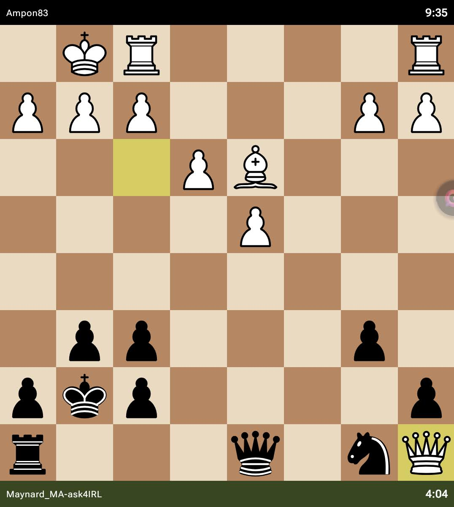

# Wrist Chess for Phones

This is an unofficial, modified build of **Wrist Chess** (v1.10.1 / versionCode 173), originally a Wear OS-only app by kusik, enabling it to run natively on standard Android phones. 

It was specifically built to play offline against the embedded Fairy-Stockfish engine on devices like the Unihertz Titan 2 Elite, including full 64-bit (arm64-v8a) native libraries and various UI shims so it correctly sizes the board and menus for phone screens.

## Modifications Made
- **Manifest Adjustments**: Removed Wear OS hardware restrictions and split-APK requirements.
- **Native Libraries**: Added compiled `arm64-v8a` libraries for Fairy-Stockfish so it installs on modern 64-bit-only phones.
- **UI Shims**: 
  - Adjusted the chess board to use `smallestScreenWidthDp` minus a margin, so it fills phone screens properly without cutting off the player names.
  - Scaled down the typography for the Puzzles screen to prevent text clipping.
  - Injected an exported shim for `REMOTE_INPUT` to fix crashes when clicking the API token button.
- **Time Controls**: Hand-patched the available time pairs to match classical choices (e.g. 1+0, 3+2, 5+3, 10+5, 15+10, 30+20).
- **Environment Stubs**: Injected fake `com.google.wear.Sdk$VERSION` classes so the app doesn't crash from missing Wear OS SDK APIs on Android 14+.

## How it was built
See the build scripts in this repo (`wristchess_phone_build.py` and `patch_out_rg3.py`).

## License
The original app is by kusik. The arm64 JNI shim and Fairy-Stockfish engine are GPLv3.
